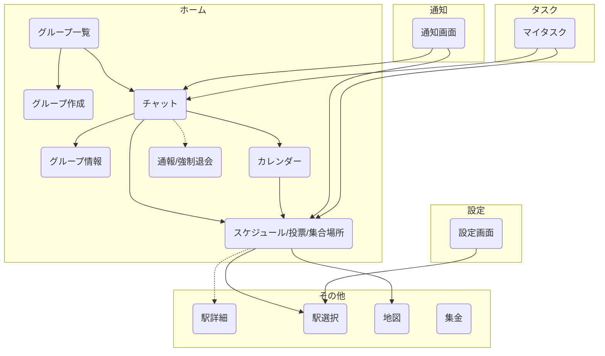

# gatheragain-app

## Build & Release

```
eas build --profile preview --platform all --no-wait
eas build --profile preview --platform ios --no-wait
eas build --profile preview --platform android --no-wait

🔮 feature(not working submit)
add option >  --auto-submit
```

## 運用メモ

- アプリバージョンはバージョン X.X.X で運用
- releaseChannel はバージョン X.X で管理する（マイナーバージョンは指定しない）
- ビルドが必要なバグ修正などに関してはアプリバージョンのパッチバージョンを上げる
  - → つまりは基本的に機能開発のマイナーバージョン以上でないと releaseChannel は変更しない


